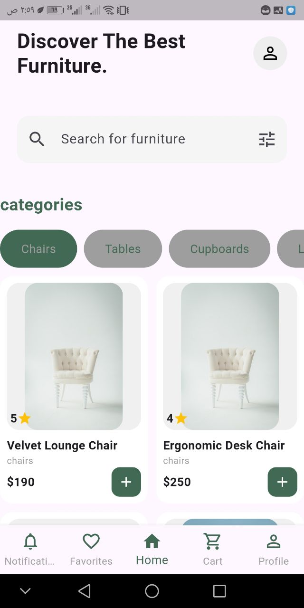
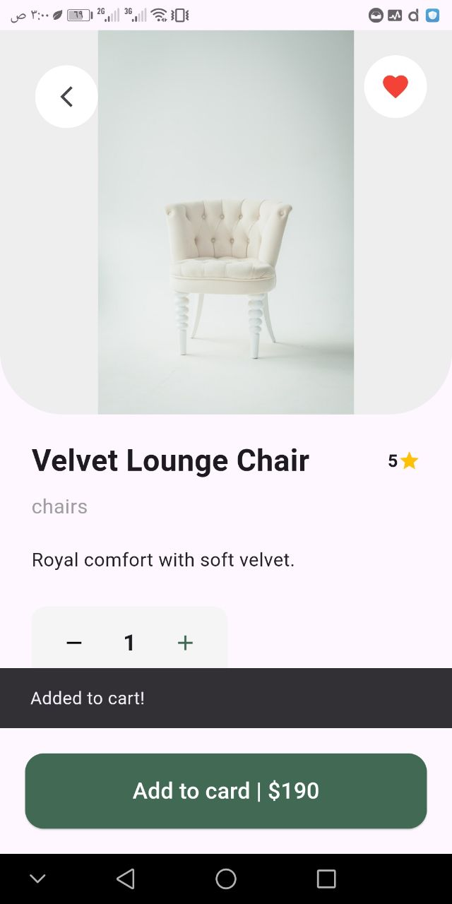
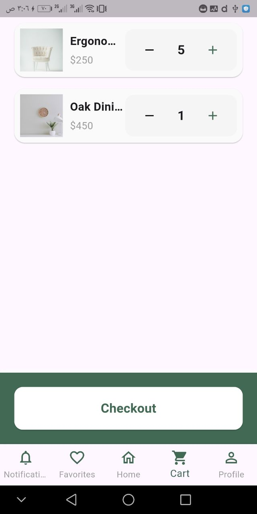
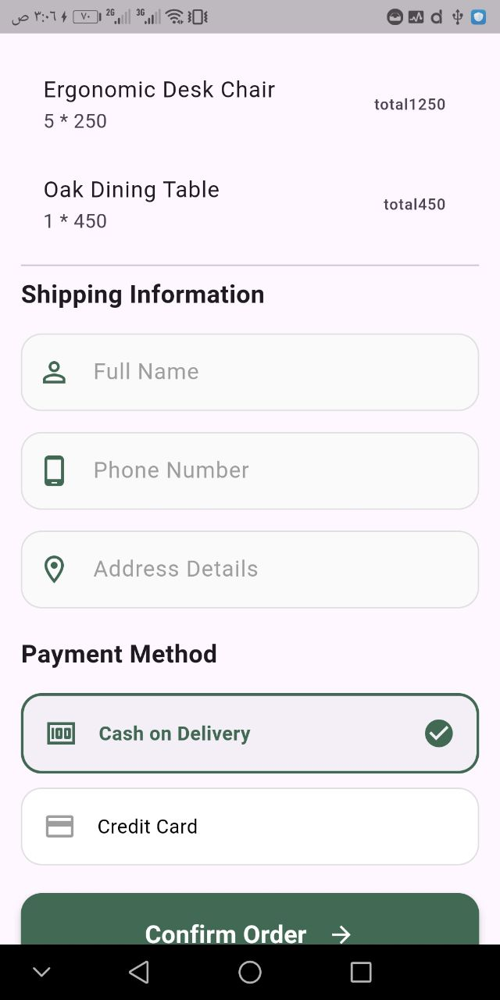
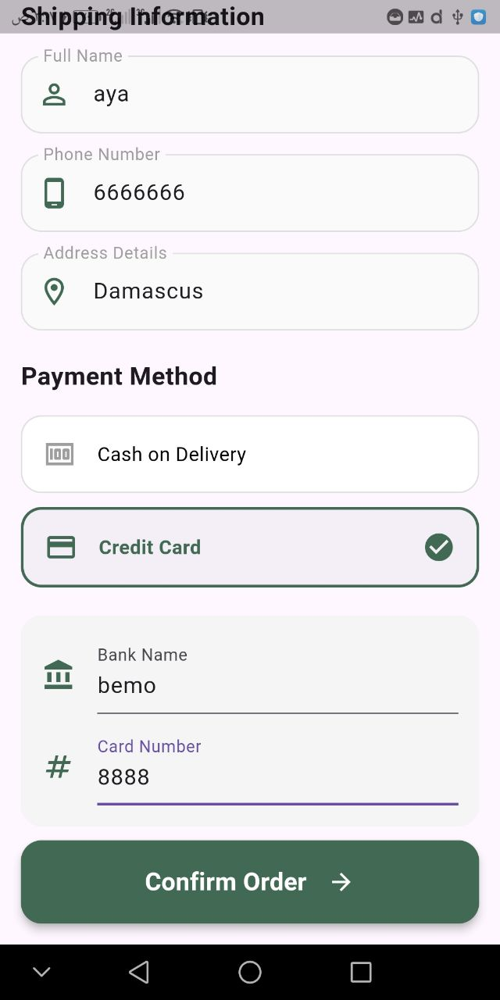

# Furniture Store App

A modern, responsive, and feature-rich **E-commerce Flutter application** for furniture shopping.  
Built with **Flutter**, **Firebase**, and **Provider**, following **Clean Code** principles.

---

## Features

- Real-time products fetched from Firebase Firestore  
- Best Sellers page  
- Product filtering by category (Chairs, Tables, Lamps, etc.)  
- Product details page  
- Favorites system using SharedPreferences  
- Shopping cart with quantity control  
- Checkout page (Cash / Card)  
- Persistent cart & favorites after restart  
- Provider state management  
- Snackbars for user feedback  
- Clean navigation between screens

---

## Future Improvements

- Search & advanced filtering  
- Firebase notifications  
- Login / Sign Up (Firebase Auth)  
- Profile page  
- Order history page  

---

## Tech Stack

- Flutter / Dart  
- Firebase Firestore  
- Provider  
- SharedPreferences  
- Clean Code architecture

---

## Screenshots

- Products Page  


- Best Sellers Page  


- Product Details Page  


- Favorites Page  


- Cart Page  


- Checkout Cash  


- Checkout Card  


---

## How to Run

1. Install dependencies

```
flutter pub get
```

2. Add Firebase configuration

Download your google-services.json file from Firebase  
and put it inside:

```
android/app/google-services.json
```

3. Run the app

```
flutter run
```

4. Build APK (optional)

```
flutter build apk --release
```

APK file will be located at:

```
build/app/outputs/flutter-apk/app-release.apk
```
